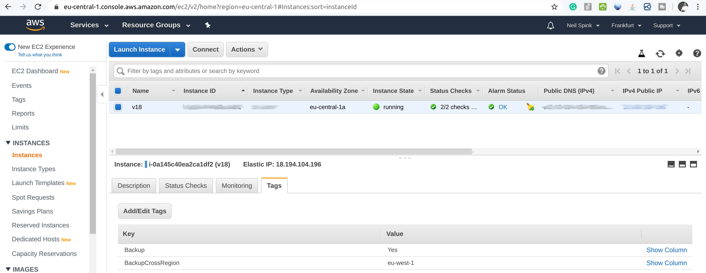
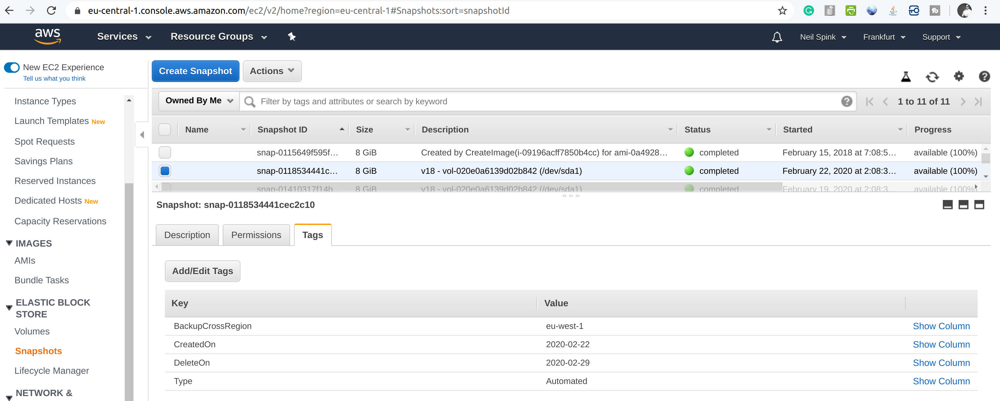

## Overview

Functions for running AWS EC2 EBS volume snapshots and copying them to other regions for disaster recovery protection.

Do first investigate
https://aws.amazon.com/premiumsupport/knowledge-center/ebs-snapshot-data-lifecycle-manager/

This is an extension on a implementation forked from 
https://github.com/joshtrichards/aws-ebs-snapshots-lambda 

## Functionality:

- Automatic snapshots (on whatever schedule you prefer)
- Copying snapshots to another AWS region
- Automated expiration of old snapshots
- Ability to configure retention period on a per EC2 instance basis (applying to all volumes attached to said instance)
- Ability to manually tag individual snapshots to be kept indefinitely (regardless of instance retention configuration)
- Does not require a job/management instance; no resources to provision to run snapshot jobs (leverages AWS Lambda)

## Implementation Details

Configuration is done through tags that you add to your ECS instances 

Backup: Yes
BackupCrossRegion: <give-target-region-code>

Your snapshots will look something like this

## Files:

Each file here implements a single AWS Lambda function.

- ebs-snapshot-creator.py (run daily)
- ebs-snapshot-manager.py (run daily)
- ebs-snapshot-cross-region.py (run weekly)

Setup a rule to run these in AWS CloudWatch.

There is a gotcha: If the instance is running, EBS snapshots are as if someone pulled out the power 
cord of the computer, pulled the volume out and copied it (the snapshot), then turned the computer 
back on. I've been using it on WordPress server for a few years, my work around is running database 
dumps via cron. I've included an example how I did it in the following file mysql-backup.sh

